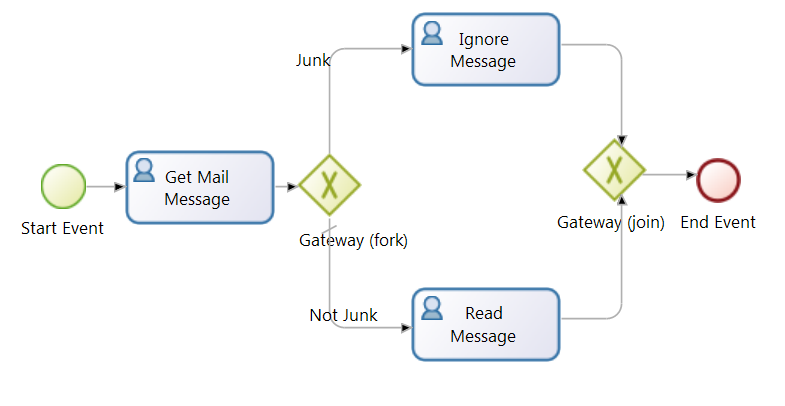
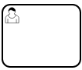
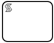
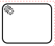
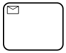
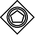
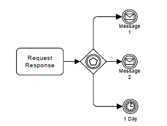

<h1>Introduction to BPMN Processes</h1>

<strong>Process</strong> defines the sequence and rules of flow objects:

<strong>Events</strong>:  something that happens during the process

<strong>Activities</strong>: work Performed in the process

<strong>Gateways</strong>:  decision points to split or merge the flow

<strong>Flow</strong>:  navigation tools between Nodes (Events, Activities and Gateways).

Here is the sequence of execution

|#| Method      | Image | Description                          |
|-| ----------- | ------|------------------------------------ |
|1|
start Event
| |This is the starting point of the Process|
|2|Get Mail Message||Why: the sequence flow goes from Start Event to here

It is a user task, so a user need to complete this task|
|3|Gateway||Why: the sequence flow again brings us to this point

This is a decision (XOR) gateway, it will invoke either branch but never both, based on the logic determined earlier:

If the email is <strong>Junk</strong> it will go to <strong>Bin Message</strong>

If the email is <strong>Not Junk</strong> it will go to <strong>Read Message </strong>|
|4|Bin Message||A User Task|
|5|Read Message||Another Task|
|6|Gateway||This Gateway will wait for either Task to complete before proceeding|
|7|End Event||This will End the Process|

<h4>Supported BPMN Objects</h4>

| Type/ Notation | Description                          |
|----------------|--------------------------------------|
|Start Event|Start point for the process. Every Process must have at least one Start Event.|
|Intermediate Event|In the middle of the process|
|End Event|At end of Process|
|Normal Event

 |
|Timer Event
 |The Event goes in a wait state till the timer (delay or schedule) condition is met, then the Event is executed and continues the flow.|
|Catch Message Event

 |The Event goes in a wait state till the exepcted Message is received then the Event is executed and continues the flow.|
|Throw Message Event

||
|Catch Signal Event

 |The Event goes in a wait state till the exepcted Signal is received then the Event is executed and continues the flow.|
|Throw  Signal Event
||
|User Task
 |A User Task is a typical “workflow” Task where a human performer performs the Task with the assistance of a software application and is scheduled through a task list manager of some sort. Typically it produces a form to capture user input.|
|Script Task
||
|Service Task
||
|Receive Task
|A Receive Task is a simple Task that is designed to wait for a Message</a> to arrive from an external Participant (relative to the Process). Once the Message has been received, the Task is completed.|
|Send Task
|A Send Task is a simple Task that is designed to send a Message</a> to an external Participant (relative to the Process). Once the Message has been sent, the Task is completed.|

|           | Inbound (Converging)| Outbound (Diverging) |                      
|-----------|---------------------|----------------------|
|Parallel Gateway(AND) 
 |It waits for <strong>all active </strong>incoming branches to complete.|<strong>all</strong> outgoing branches are activated simultaneously.|
|Exclusive Gateway (XOR)
|it waits for <strong>one</strong> incoming branch to complete|<strong>Only one</strong> of the outgoing branches based on conditions.|
| Inclusive Gatewy (OR)
  |It waits for <strong>all active</strong> incoming branches to complete.|<strong> One or more</strong> branches are activated based on branching conditions.|
| Event-Based Gateway
   | Waits for the any event to take place before proceeding, then cancels other events.|

