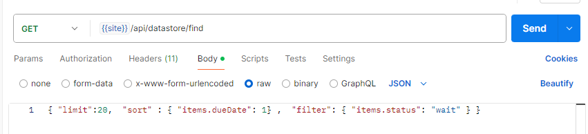
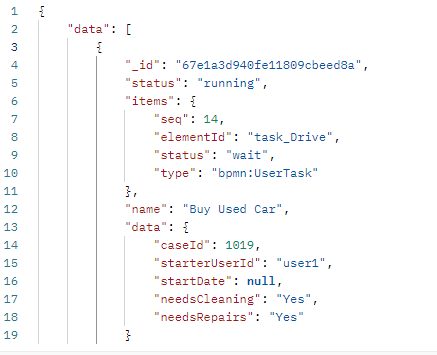

# data.find method

 This method allows you to retrieve workflow instances from `wf_instances` collection.

 - Allows of server-side pagination 
 - It allows filtering, sorting, and projecting fields in the results.
 - The results can be paginated using a cursor for efficient data retrieval.

## Usage

```ts
            const {data,nextCursor,error,totalCount} 
            = await server.dataStore.find({
              filter,sort,projection,limit,after,getTotalCount
            });
```

### find parameters
 All the parameters are optional 

 - `sort` 
  Sort field can be specified as an object with field name as key and 1 (ascending)  or -1 (descending) as values.

	    Sort by `_id` in descending order by default.
      Examples:
      {"data.caseId:1}
      {"items.dueDate:1}
      {"items.startedAt:-1}}
      {"_id:-1}

		Note that MongoDB _id field is sequential, so descending order means most recently created instances

 - `filter` is an object that specifies the criteria for filtering the results.
      Examples:
        "status":"end"
        "items.status":"wait"
        "items.type":"bpmn:UserTask"

 - `limit` is a number that specifies the maximum number of documents to return in the result set.

 - `projection` is an object that specifies which fields to include or exclude in the returned documents.
      You need to list all fields that are part of output

 - `after` is a string that specifies the cursor for pagination, allowing you to retrieve results after a specific document.	

 - `getTotalCount` returns the total number of records. (this requires additional processing, so you may call it only once.)

 **Important Note: `projection` must include all fields in the filter and sort.**

### Find Output

find returns {data,nextCursor,error,totalCount}

- data: an array of instances fields as specified in the projection
but notice that `items` field (if requested) is a single object not an array.
- nextCursor: value to be used for next call
- error: any error msg 
- totalCount: if requested

### Example Code 

The example below shows how to call for find method and the output:

```ts

import  { configuration, FindParams }   from './';;
import { BPMNServer, Logger } from './';
import { EventEmitter } from 'events';

const logger = new Logger({ toConsole: true});

let name = 'find';
const server = new BPMNServer(configuration, logger, { cron: false });

main();

async function main() {


	await findAggregation({ name: 'Buy Used Car' ,"items.status": 'wait' });	// has any item in wait status
	console.log('--------------------------------------');
	await findAggregation({ name: 'Buy Used Car' ,"status": 'end' });			// instances with end status
}
async function findAggregation(filter) {
    // benchmark findInstances
        console.time('find-instances call');
    
    let insts=await server.dataStore.findInstances(filter, 'summary');
    let lastIns=insts[insts.length-1];
    console.log('findInstances:',insts.length,lastIns.startedAt,lastIns.data.caseId);

    console.timeEnd('find-instances call');

    // benchmark find)

    // works perfect
    let nextCursor = null;
    let param:FindParams = {
        getTotalCount: true, // get the total count of records
        limit: 50, // limit to 10 records per page
        filter: filter, // filter by process name
        sort: { _id: 1 },   // sort by _id to get the earliest first
        projection: { id: 1, data: 1, name: 1, _id:1,startedAt:1,status:1,  // columns to return
            items: {        
                $filter: {  // filter items to only include UserTask types    
                  input: "$items",
                  as: "item",
                  cond: {
                   $eq: ["$$item.type", "bpmn:UserTask"] // filter to include only UserTask items
                  }
                }
        }
    }};

    for(let i=0;i<100;i++) {
            if (i>0)
                param.after=nextCursor;
    
            console.time('find-aggregation call');
            let res=await server.dataStore.find(param);
    
            if (i===0)
			{
                console.log('findAggregation    total', res.totalCount,'total pages', Math.ceil(res.totalCount/param.limit));
				console.log(JSON.stringify(param,null,2));
				console.log('-----------------------------------------');
			}

            param.getTotalCount=false; // do not get the total count again
            if (res.error) {
                console.log('error',res.error);
                return;
            }
            else if(!res.data)
                return;
            let first=res.data?res.data[0]:null;
            let last=res.data?res.data[res.data.length-1]:null;
    
            nextCursor=res.nextCursor;
            
            console.timeEnd('find-aggregation call');
    
            console.log('findAggregation    page:',i+1,'length:',res.data.length,res.nextCursor,first.startedAt,first.data.caseId,last.data.caseId);//.data.length, res.data[0] );

			if (i==0) {
				console.log('Sample Instance Items:');
				first.items.forEach(item=>{
					console.log(`	item:# ${item.seq} 	${item.name}	status:${item.status}`);
				})
			}

            if(res.data.length<param.limit)
                break;

    }
}


```
### Example Output



