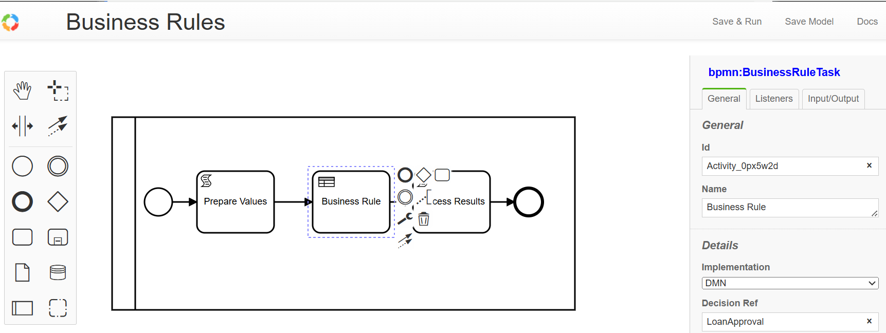

# Business Rules Task
## Overview
- Business Rules Tasks support DMN 1.3 Decision Tables
- Business Rules (Decision Table) are edited using [text](https://demo.bpmn.io/dmn)
- Business Rules are executing as part of BPMN process

## Features
### ✅ **DMN 1.3 Compatibility**
- Parses and processes **DMN 1.3 XML files**.
- Supports decision tables with **multiple input and output columns**.

### ✅ **Hit Policy Support**
- `FIRST` → Returns the first matching rule.
- `COLLECT` → Returns all matching rules.
- `PRIORITY` → Returns the highest-priority rule.
- `SUM` → Sums numerical outputs from matching rules.
- `RULE ORDER` → Returns results in rule order.
- `UNIQUE` → Ensures only one rule matches; throws an error otherwise.

### ✅ **Rule Execution Engine**
- **Evaluates inputs against decision tables.**
- **Applies operators** (`>`, `<`, `>=`, `<=`, `==`, `!=`).
- Supports **wildcard conditions** (`-` or `null` matches any value).
- Supports **FEEL** expressions examples:
```ts
	{credit_score in [500 .. 600]}
```
P.S. FEEL expression must start with { and end with }

# Integration with bpmn-server

DMN Rule files are saved in same folder as processes in `.env` file
```ts
DEFINITIONS_PATH="./processes/"
```
DMN Rules are called either through the API:
```ts
	//	api.dmn.evaluate(dmnRuleFileName,input);
	let result = await api.dmn.evaluate('loan_approval',{credit_score:620,income:52000});
	console.log('dmnResult:',result);
```
The above will return:
``` sh
dmnResult: { approvalStatus: 'Approved', maxAmount: 5000 }
```
But more commonly, DMN Rules can be invoked as an activity of type `Business Rule Task`
 input and output variables can be defined as well.

## Edior
https://demo.bpmn.io/dmn