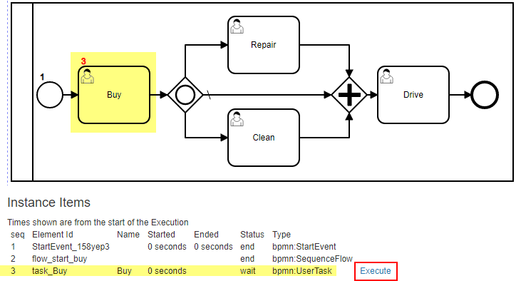
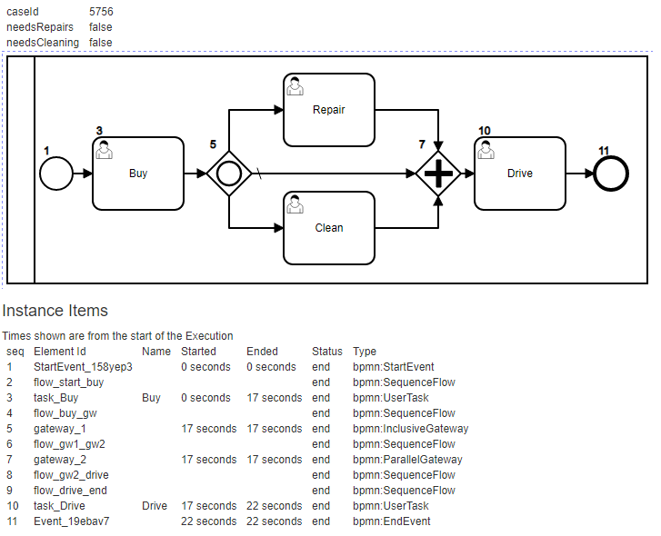

# Buy Used Car Example:


For the model above we will walk-through how to execute it programaticaly.

## Using bpmn-server Server Class

```ts
const { configuration } = require('../configuration.js');

const api = new BPMNAPI(new BPMNServer(configuration));
```

The api object provides a set of components;for now, we need the engine
We start a process execution by name; in this case 'Buy Used Car'
BPMN definitions are saved our catalog as defined by the [configuration](../setup.md), in our WebApp they are under WebApp/WorkflowApp/processes folder

```ts
test();

async function test() {


    let currentUser =new SecureUser(request.user);
\\ or :
    let user1 =new SecureUser({ userName: 'user1', userGroups: ['Owner', 'Others']});

```

bpmn-server support Access Control, so we need to define the user information when invoking any API call

At minimum, you need to pass the `userName` and `userGroups` that user belongs to:

```ts

    \\start(name: any, data?: any,userName?: string, options?: any): Promise<IExecution>;

    let response=await api.engine.start('Buy Used Car',{},SystemUser);

```

    the above will launch a new instance of the process, going through all the bpmn elements and pause at our User Task or an event.

    let us get the items; items are the instances of various nodes executed so far



```ts
const items = response.items.filter((item) => {
  return item.status == 'wait';
});

items.forEach((item) => {
  console.log(`  waiting for <${item.name}> -<${item.elementId}> id: <${item.id}> `);
});
const itemId = items[0].id;

console.log(`Invoking Buy id: <${itemId}>`);
```

We now need to specify which node to invoke, keep in mind this can happen any time later
so we need to identify the instance as well as the item, but since the ItemId is unique we can use it for the query.

The [query](../data.md) is passed to MongoDB to select the appropriate item.

```ts
const input = { model: 'Thunderbird', needsRepairs: false, needsCleaning: false };
response = await api.engine.invoke({ items: { id: itemId } }, input);

console.log('Ready to drive');
```

    keeping in mind that the bpmn definition defines conditional flow as such:

```ts

    <bpmn:sequenceFlow id="flow_gw1_clean" sourceRef="gateway_1" targetRef="task_clean">
      <bpmn:conditionExpression xsi:type="bpmn:tExpression"><![CDATA[
      $(this.needsCleaning=="Yes")
      ]]></bpmn:conditionExpression>
    </bpmn:sequenceFlow>

```

    in the next step, we will query on instance id as well as the element id

```ts
    response = await api.engine.invoke({ instance: { response.execution.id }, items: {elementId: 'task_Drive' }});

    console.log(`that is it!, process is now complete status=<${response.execution.status}>`)

}

```

The instance Items should look like this:


