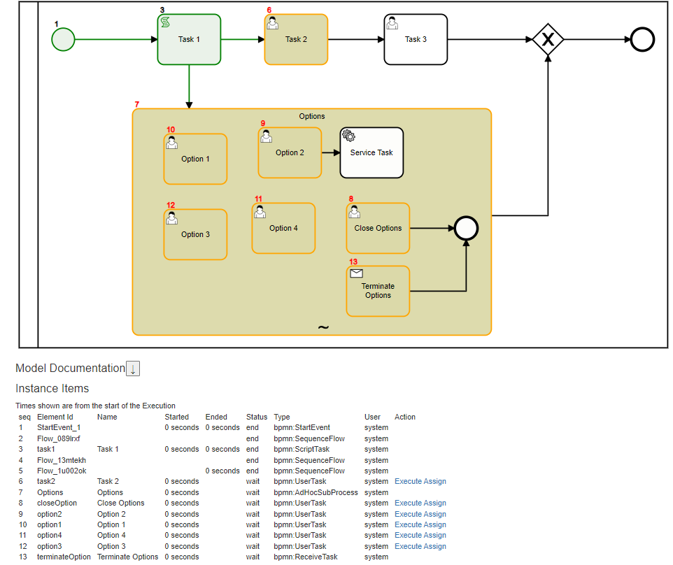
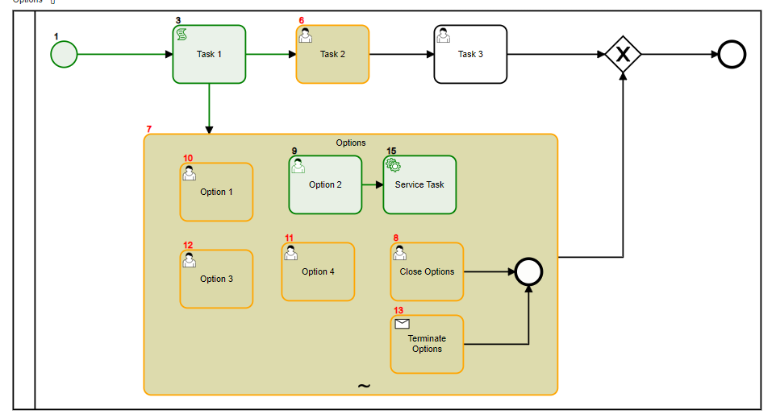

# Ad-Hoc SubProcess

Ad-Hoc subprocess allow you to choose the activity you like to invoke:
- On start of subprocess; all activities start in a wait state
- User can Invoke 'Execute' any task
- SubProcess is completed when:
    - End Event is reached through a sequence flow
    - `CompletionCondition` returns true
## CompletionCondition
    





Implementing an ad-hoc subprocess in BPMN (Business Process Model and Notation) involves creating a subprocess that contains a set of activities that do not follow a pre-defined sequence. Here’s a step-by-step guide on how to do this:

### 1. Define the Ad-Hoc Subprocess

In your BPMN diagram, add an **Ad-Hoc Subprocess** element. This subprocess will encapsulate the activities that can be performed in any order.

### 2. Add Activities to the Ad-Hoc Subprocess

Inside the ad-hoc subprocess, add the various activities (tasks, subprocesses, etc.) that are part of this subprocess. These activities can be performed in any sequence.

### 3. Configure the Ad-Hoc Behavior

Specify the conditions or rules for the ad-hoc subprocess:

- **Completion Condition**: Define a condition under which the subprocess will be considered complete. This could be the completion of a specific task or a certain state of the process data.
- **Ordering**: By default, the activities within an ad-hoc subprocess are unordered. However, you can define dependencies if some activities need to be completed before others.

### 4. Model Execution Details

Ensure that each activity within the ad-hoc subprocess has its own execution details, such as:

- **Task Types**: Define if the task is a user task, service task, script task, etc.
- **Assignment**: Specify who will perform each task (users, groups, etc.).
- **Data Handling**: Define input and output data for each task.

### 5. Integrate the Ad-Hoc Subprocess into the Main Process

Connect the ad-hoc subprocess to the rest of your BPMN model by defining incoming and outgoing sequence flows. This ensures that the ad-hoc subprocess is triggered at the appropriate time and that the process can continue after its completion.

### Example

Here is a simplified XML snippet illustrating an ad-hoc subprocess in BPMN:

```xml
<bpmn:adHocSubProcess id="AdHocSubProcess_1" name="Ad-Hoc Subprocess" ordering="Parallel">
  <bpmn:completionCondition xsi:type="bpmn:tFormalExpression">
    <![CDATA[someCondition()]]>
  </bpmn:completionCondition>
  <bpmn:task id="Task_1" name="Task 1" />
  <bpmn:task id="Task_2" name="Task 2" />
  <bpmn:task id="Task_3" name="Task 3" />
  <!-- More tasks as needed -->
</bpmn:adHocSubProcess>
```

### Conclusion

An ad-hoc subprocess in BPMN allows for flexible execution of activities, making it suitable for scenarios where the sequence of tasks is not strictly defined. By defining an ad-hoc subprocess, you can model complex workflows that require adaptability and dynamism.