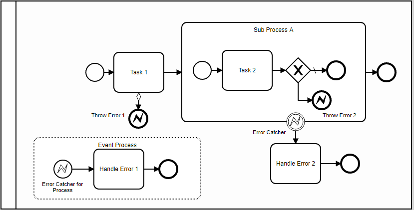

# Error Events:



## Raising Errors
### Through an End Events of type Error

```ts
    <bpmn2:endEvent id="EmdEvemt_error1" name="Throw Error 1">
      <bpmn2:incoming>SequenceFlow_0plhz17</bpmn2:incoming>
      <bpmn2:errorEventDefinition />
    </bpmn2:endEvent>
```
### Through Tasks

Also Scripts and Services Tasks can Raise BPMN Errors/Escalation/Exception 

    return {bpmnError:'error code'};
All Scripts and Services can Raise BPMN Escalation, to be handled by the appropriate Catch Escalation Event

    return {escalation:'escalation code'};
The current item status will be error and execution will continue at the Error node.
Throwing Exceptions#

    new error('error message');
This will raise an Excption, stop workflow execution and save the instance datatake action

## Error Handling

- If there is a Boundary Event to catch, it will be invoked
- else if there a start Event to catch it will be invoked.
- else Default error handling will be processed.

Example of Boundary Event

    <bpmn2:boundaryEvent id="BoundaryEvent_catchErrors" name="Error Catcher" attachedToRef="Task_1yw3plw">
      <bpmn2:outgoing>SequenceFlow_0t9u8g1</bpmn2:outgoing>
      <bpmn2:errorEventDefinition />
    </bpmn2:boundaryEvent>


Example of Start Event 
```ts
    <bpmn2:subProcess id="SubProcess_0hpeg3q" name="Event Process" triggeredByEvent="true">
      <bpmn2:sequenceFlow id="SequenceFlow_1l0v2kk" sourceRef="StartEvent_catchErrors" targetRef="Task_10xnxy7" />
      <bpmn2:startEvent id="StartEvent_catchErrors" name="Error Catcher for Process">
        <bpmn2:outgoing>SequenceFlow_1l0v2kk</bpmn2:outgoing>
        <bpmn2:errorEventDefinition />
      </bpmn2:startEvent>
```
   