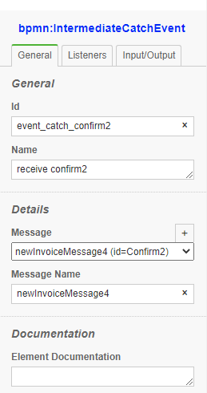

# Throwing and Cathcing Messages

In this example, we will demonstrate how can two seperate processes communicate through "Messages"

 

### 1 Throw a message with data
When a process throw a message, bpmn-server checks if there is another process that can catch this message before dispatching it to AppDelegate.

```xml
    <bpmn2:intermediateThrowEvent id="throw_msg1" name="msg1">
      <bpmn2:messageEventDefinition id="messageEventDef1" messageRef="Msg1" />
      <bpmn2:extensionElements>
        <camunda:script event="start"><![CDATA[
        input.caseId= data.caseId;
        this.messageMatchingKey={'data.caseId': data.caseId };
        ]]></camunda:script>
      </bpmn2:extensionElements>
      ...
    </bpmn2:intermediateThrowEvent>
```
The above will through a messsage as follows:
- Message Id:             `Msg1`
- Message Output:         `caseId: <someValue>`

### 2 Catch a message with data
The second process defines a start event to catch the message `Msg1`
```xml
    <bpmn2:startEvent id="StartEvent_1w66wpl" name="msg1">
      ...
      <bpmn2:messageEventDefinition id="messageEventDef4" messageRef="Msg1" />
    </bpmn2:startEvent>

```
Therefore, the system will create a new instance of the second process and assign the Message output data, namely, the caseId

### 3 Throw a message with data and a Key

In addition, the second process sends a confirmation message `Confirm1` to the first process
```xml
    <bpmn2:intermediateThrowEvent id="throw_confirm1" name="confirm1">
      <bpmn2:messageEventDefinition id="messageEventDef2" messageRef="Confirm1" />
      <bpmn2:extensionElements>
        <camunda:script event="transformOutput"><![CDATA[

        this.output.confirm=true;
        this.context.messageMatchingKey={'data.caseId': this.token.data.caseId };

        ]]></camunda:script>
      </bpmn2:extensionElements>
        ...
    </bpmn2:intermediateThrowEvent>
```

Howerver, the challenge here is that make sure the message is sent to the specific instance, that is where the Matching key is used
- Message Id:             `Confirm1`
- Message Output:         `confirm: true`
- Message Matching Keyt:   'data.caseId': this.token.data.caseId 

```ts
```


