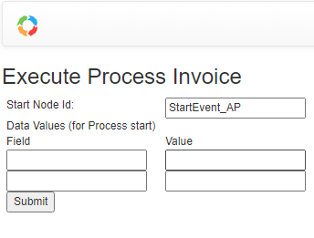

# Multiple Start Event


When a definition/process has multiple start node, you need to specify the start node when starting the process:

From the Web UI:



From API:
```ts
    
    response = await api.engine.start('invoice', 
        { reminderCounter: 0, caseId: caseId}, user, {startNodeId:'StartEvent_AP'});
```
