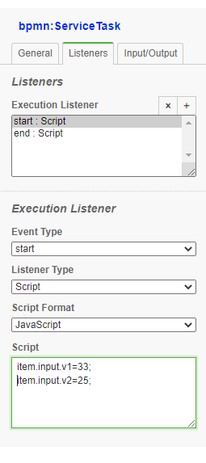

# Script Events

Scripts can be added to listen to two events:
- Start before the Task is executed
- End after the task is executed

{align=left}


In this example we are adding a script to bpmn:startEvent

```xml
    <bpmn2:extensionElements>
      <camunda:executionListener event="start">
        <camunda:script scriptFormat="JavaScript">
          
           console.log("This is the start event");
          data.records=[1,2,3];
          console.log(data);

        </camunda:script>
      </camunda:executionListener>
      <camunda:executionListener event="end">
        <camunda:script scriptFormat="JavaScript">
          
          console.log("This is the end event");          


          </camunda:script>
      </camunda:executionListener>
    </bpmn2:extensionElements>

   
```

<div style="clear:both"></div>
