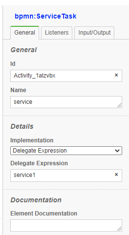

# Service Task

In Process definition (.bpmn file), use `implementation` attribute to define name of JavaScript/TypeScript Method to perform the Task:

{align=left}

```xml
    <bpmn:serviceTask id="serviceTask" name="Service Task" implementation="service1">
    ...
    </bpmn:serviceTask>
```

```ts 
class AppServices {

    async service1(item,input) {
        seq++;
        await delay(3000 -(seq * 100) , 'test');
        item.log("SERVICE 1" + item.token.currentNode.id);
    }
}

```
<div style="clear:both"></div>