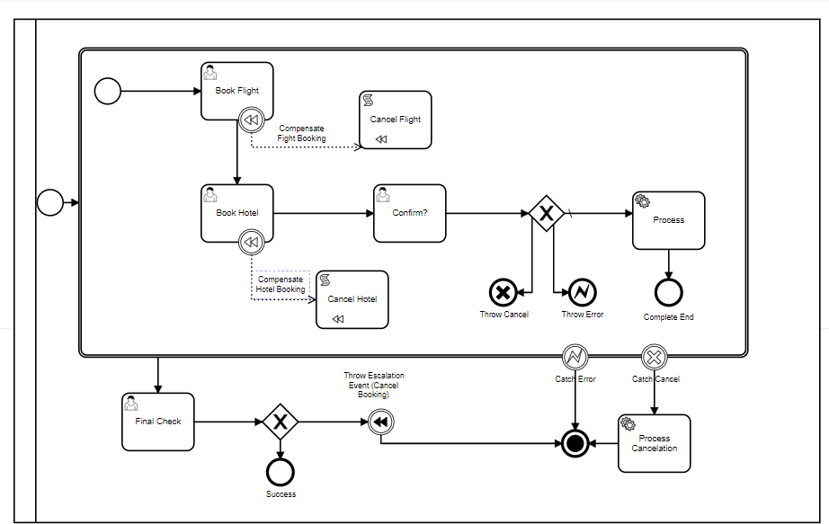
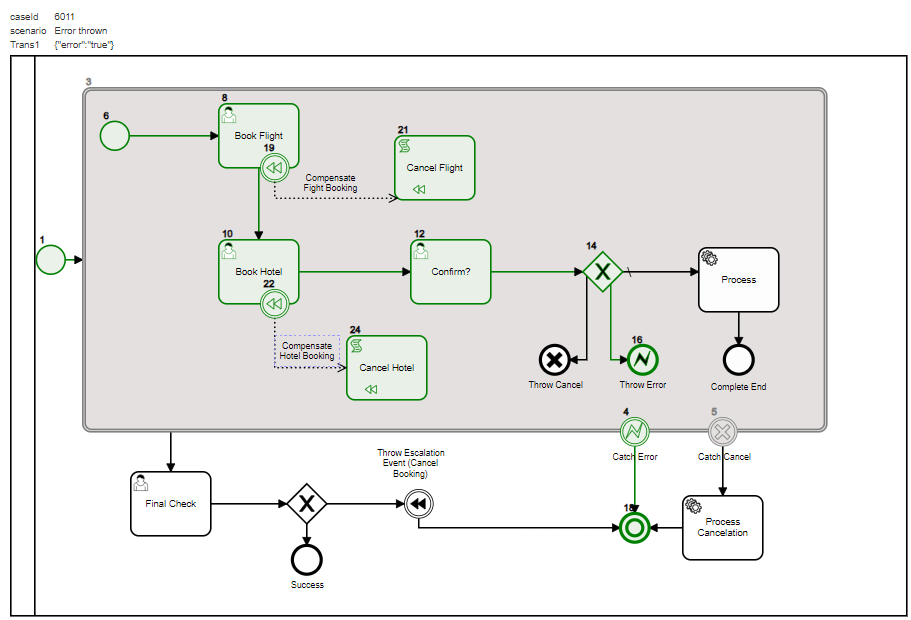
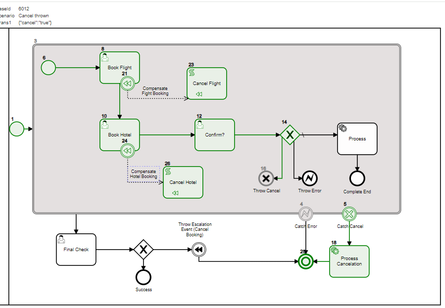

# Transactions

- Transactions has boundaries similar to subProcess
- Transaction Activities can have a compensating Activities, in the above `Cancel Flight` compensate for `Book Flight` 
- Transactions can be Compensated (rolled back) by either throwing an 
    - `Error Event` during the transaction
    - `Cancel Event` during the transaction
    - `Compensate Event` after the transaction is completed

In this example:

- A conditional flow throw `End Event:Throw Cancel Event` (#14)
- Caused `Boundary Event:Catch Cancel` (#5) to be executed
- In turn continued to `Process Cancelation` (#22)
- Transaction is canceled (#3)

