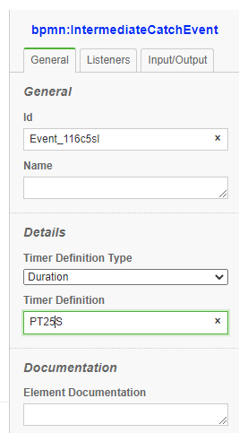

# Timers


{align=left}

```xml
    <bpmn:intermediateCatchEvent id="Event_timer">
      <bpmn:incoming>Flow_1sg7v2d</bpmn:incoming>
      <bpmn:outgoing>Flow_1nku8og</bpmn:outgoing>
      <bpmn:timerEventDefinition id="TimerEventDefinition_07xu06a">
        <bpmn:timeDuration xsi:type="bpmn:tExpression">PT2S</bpmn:timeDuration>
      </bpmn:timerEventDefinition>
    </bpmn:intermediateCatchEvent>
```
<div style="clear:both"></div>

All Timers are persisted, therefore, if the Node.js session is restared timers will pickup where they left     
## Timer Types

### DateTime (not supported)
```ts
  <timerEventDefinition>
        <timeDate>2011-03-11T12:13:14Z</timeDate>
    </timerEventDefinition>
```
### Duration

Example (interval lasting 10 days):

```ts
    <timerEventDefinition>
        <timeDuration>P10D</timeDuration>
    </timerEventDefinition>
```

### Time Cycle

Example (3 repeating intervals, each lasting 10 hours):

```ts
    <timerEventDefinition>
        <timeCycle>R3/PT10H</timeCycle>
    </timerEventDefinition>
```

Time Cycle accepts both ISO 8601 format and Cron format

Example for cron format:

```ts
    <timerEventDefinition>
        <bpmn:timeCycle xsi:type="bpmn:tFormalExpression">5 * * * *</bpmn:timeCycle>
    </timerEventDefinition>
```

## ISO 8601 format:
This format displays a duration in the following format: PnYnMnDTnHnMnS where n is the number for the corresponding interval:

Y = years

M = months

W = weeks

D = days

T = delineator between dates and times, necessary to disambiguate between months and minutes

H = hours

M = minutes

S = seconds

You can leave certain intervals off  if they don't apply, but you must include the T before any time intervals (P<date>T<time>). Valid examples include:

P3Y6M4DT12H30M5S (3 years, 6 months, 4 days, 12 hours, 30 minutes, and 5 seconds)

P3DT12H (3 days and 12 hours)

P1M (1 month)

PT1M (1 minute)

PT0S (0)

P0.5Y (1/2 a year)

PT1M3.025S (1 minute and 3025 milliseconds)


## Development/Test Environment Timer modification

bpmn-server allow you to modify the timer behaviour during development without changing bpmn definition

By changing the configuration.ts to force timers to specific time

```ts

let definitionsPath = __dirname + '/processes/';
var configuration = new Configuration(
	{
		definitionsPath: definitionsPath,
		timers: {
			forceTimersDelay: 1000,
			precision: 3000,
		},
```

## Event Types

| Event Type | TimeDate  |  Duration  | TimeCycle  | TimeCycle Repeat |
| -------------|-----------|  -------------|-----------|-------- |
| Start          | NA       | NA             | Yes        |Default |
|Intermediate    | NA      |Yes            |Yes        |NA |
|Boundary Event   |NA         |Yes            |Yes        |Yes |


- Start Event support 'Time Cycle' only since duration and timeDate make no sense.
 
- Intermediate Events are implemented as a normal event, will start the timer at start of the node and once the timer is completed the node will end.

- Start Event Timers will start a new execution, therefore, they are scheduled by a cron job managed by bpmn-server.


## Implementation:
   
### On Server start:

1. All start event are re-evaluated and reschedules
2. other events that are in wait state are re-evaluated and reschedules


       
