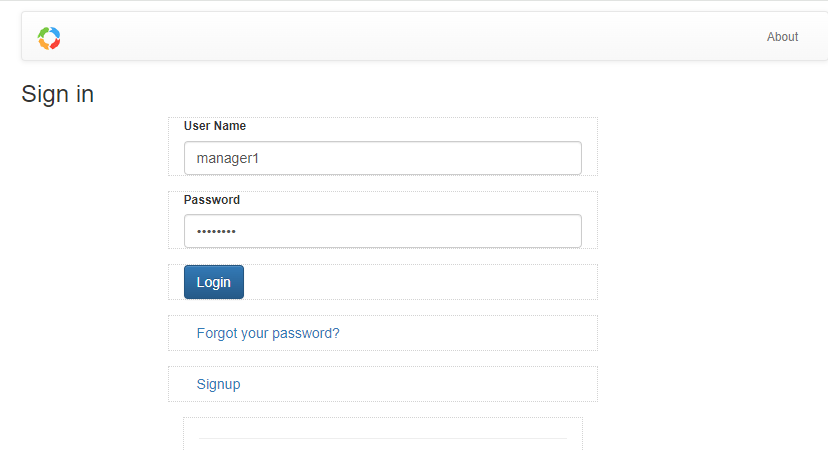

# Tutorial: Manager to Approve Leave Application
## Login as 'manager1

Login as manager1:

    User Name:  manager1

    password:   manager1

## Execute 'Approve' Task

As a manager, will see 'Leave Applications' that require `Approval`

## Fill Approval Form

