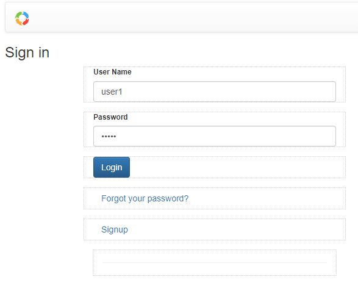

# Tutorial: Employee to Start a Leave Application 

Use your browser to view the bpmn-server running [localhost:3000](http://localhost:3000)

## 1 Login as User1



Login as user1:

    User Name:  user1

    password:   user1

## 2 Select Model 'Leave Application'


## 3 Execute
This will start a new 'Leave Application' workflow

## 4 Provide Input Data


## Back to home page


User 'user1' is now completed the request, waiting for his/her manager to approve

## Login as 'manager1


Login as manager1:

    User Name:  manager1

    password:   manager1


## Execute 'Approve' Task

As a manager, will see 'Leave Applications' that require `Approval`

## Fill Approval Form


## Let us examine the completed workflow


## Now Let us see the Design Details:

### `Start Event` - `initiator`
```
    initiator	    requester
```
We need to record the user that started the workflow by saving userName into `data.requester` this will be used later.

### `Request Task` - `assignee`
```
	assignee    	$(this.data.requester)
```
We now copy the `data.requester` into `item.assignee`, this will restrict access only to user that started the workflow.

### `Approve Task` - `assignee`

```
	assignee	    #(appServices.getSupervisorUser(this.data.requester))
```

In this case, the approver user is in a database collection 'usersManager', so we need to write some TS code to retrieve this info.
Notice `#` to indicate async call, this is requires db call.
```ts
    async getSupervisorUser(userName, context) {
        console.log('getSupervisorUser for:',userName);


        let ds=this.appDelegate.server.dataStore;
        const dburl=ds.dbConfiguration.db; // process.env.MONGO_DB_URL;

        const db=ds.dataStore.db;

        // collection structure: {employee,manager}
        
        let list=await db.find(dburl,'usersManager',{employee:userName});
        let manager;
        if (list.length>0)
            manager=list[0]['manager'];
        
        return manager;
    }

```


